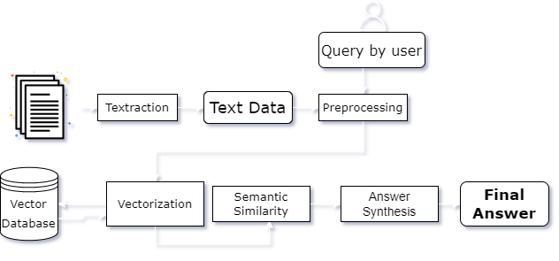

<h1 align="center">Welcome to Ekatra QnA System 👋</h1>
<p>
  <a href="." target="_blank">
    
  </a>
  <a href="#" target="_blank">
    
  </a>
  <a href="https://twitter.com/ekatraone" target="_blank">
    
  </a>
</p>

> Ekatra QnA is a student-focused intelligent search engine that enables them to find answers across various sources.

### 🏠 [Homepage](https://github.com/ekatraone/Ekatra-QnA-System)
---
### 1. Unlock the power of learning with our innovative micro learning courses delivered straight to your WhatsApp! Embark on a journey of discovery and growth, right at your fingertips. 
### Don't miss out on this incredible opportunity, come and check it out! [Ekatra Learning](https://bit.ly/ekatra001)
<p align="center">

</p>

### 2. 🎥 Check out our wesbite [demo video](https://www.awesomescreenshot.com/video/15118083?key=c9f98dd8fcc835f6f97c1cefd7ac6317)
 


---
## Abstract

- The objective of this project is to create a smart search engine named [Ekatra](https://www.ekatra.one) QnA, which is intended to assist students in finding answers from various sources such as web links and PDF documents in a prompt and effective manner. The search engine employs NLP techniques, including text extraction, preprocessing, vectorization, and semantic similarity, to accurately and quickly identify the most suitable answers to students' queries. The intended target audience for this project is students worldwide who face difficulties in finding pertinent information from a vast amount of data.


- Ekatra QnA employs cutting-edge technologies such as OpenAI and Sentence Transformers to filter out irrelevant information and offer students the most useful and appropriate content. The system is built to boost productivity and save time for students as it efficiently identifies the required information, allowing them to concentrate more on learning and less on searching.

- Furthermore, it should be noted that all information in the search engine comes from a validated source. If the answer to a question is not present in the documents, the system is equipped to recognize this and prevent sharing misleading information.

- Many individuals struggle to find the time and resources to invest in their personal and professional development, and often find traditional classroom learning to be inflexible and limiting. Our microlearning courses on WhatsApp solve these problems and offer a new and innovative way to learn. With our bite-sized, self-paced lessons, you can easily fit learning into your busy schedule and enjoy the freedom of learning at your own speed. Our courses are accessible anytime and anywhere through WhatsApp messaging, making it easy to fit learning into your daily routine. Plus, we regularly update our courses with new content and materials, ensuring that your learning experience is always fresh and exciting

*Learn more about Ekatra here: https://www.ekatra.one/*

---

## Features
Our proposed intelligent search engine for students offers several features that address the common challenges students face when searching for information. Here are more details on each of these features:

1. **Multiple File Search:**  The system allows students to search for answers across multiple files, including PDFs. This feature ensures that students have access to a broader range of information sources, enabling them to find answers to their queries faster and more efficiently.


1.	**Simultaneous Text Extraction:** The system can extract text from multiple sources simultaneously, enabling faster and more efficient searches.

2.	**Accurate and Condensed Presentation:** 
The system presents the extracted text in the most accurate and condensed form, making it easier for students to read and understand.

4. **Relevant Content:**
- One of the most important features is its capability to detect questions that are not relevant to the provided documents. This functionality helps prevent the system from providing erroneous or misleading answers to the student.
- The system filters out irrelevant information and selects the most appropriate answer by analyzing the given data, providing students with the most useful and pertinent content.

---
## Workflow

The proposed workflow for the intelligent search engine includes the following steps:

1. Users are able to upload a PDF document to the system.
2. The system employs the PyPDF2 library to extract the text from the uploaded PDF.
3. The extracted text undergoes a preprocessing step to remove noise such as stop words and punctuation.
4. A pre-trained model from Hugging Face is used to vectorize the preprocessed text and the user's question

6. The resulting embeddings of the text and question are stored for future use.
7. The stored embeddings are used to locate similar sentences from the text.
8. The similar sentences are then combined to form a concise and accurate answer to the user's question.
9. The system presents the final answer in the most appropriate format within the provided document. If the answer cannot be found within the document, the system displays "I don't know." to the user.
----
## Tech Stack

### Programming Language

- [**Python**](https://www.python.org/doc/): A popular, high-level programming language known for its simplicity, readability, and versatility.

### Data Processing and Analysis

- [**Numpy**](https://numpy.org): A library for scientific computing and numerical analysis in Python. It provides support for large, multi-dimensional arrays and matrices, as well as a collection of mathematical functions.

### Natural Language Processing

- [**NLTK**](https://www.nltk.org): A suite of libraries and programs for natural language processing tasks such as tokenization, stemming, and part-of-speech tagging.

### PDF Text Extraction

- [**PyPDF2**](https://pypi.org/project/PyPDF2/): A pure-python library for extracting text from PDF documents. It can also be used to extract metadata and other information from PDF files.

### Web App Framework

- [**Streamlit**](https://pypi.org/project/PyPDF2/): An open-source web app framework for building interactive, customizable, and data-driven apps using Python. It provides an intuitive UI and fast feedback, making it easy to create and iterate on apps.

### AI and Machine Learning Frameworks:

- [**OpenAI**](https://openai.com): OpenAI is known for its advanced language models such as GPT-3, which provide developers with powerful natural language processing capabilities for a wide range of applications. Their language models can perform tasks such as text completion, translation, and question-answering with impressive accuracy.

- [**Huggingface**](https://huggingface.co): Hugging Face is a comprehensive platform that offers both tools and a community for data scientists, researchers, and ML engineers. The platform's tools empower users to develop, train, and implement machine learning models based on open-source code and technologies.

- [**Sentence Transformers Library**](https://huggingface.co/sentence-transformers): The Sentence Transformers library is a core component of the tech stack as it provides pre-trained models for sentence embedding generation, as well as tools for fine-tuning and training new models.

### WhatsApp Business Provider

- [**WATI**](https://www.wati.io): WhatsApp API was launched to help medium to large companies that wanted to use WhatsApp to communicate with multiple customers at scale. WhatsApp Business API enables businesses to automate communications with automated replies, WhatsApp chatbots & interactive messages.
----
## Architecture



- **Text extraction** refers to the process of extracting relevant text data from a given source, such as a PDF document, web page, or image.

- **Preprocessing** is the initial step in natural language processing, which involves cleaning and transforming raw text data into a format that is suitable for further analysis. This includes removing stop words, punctuations, converting all text to lowercase, and stemming.

- **Vectorization** is the process of converting text data into a numerical vector representation, allowing it to be processed and analyzed using mathematical algorithms. This involves converting each word or sentence into a high-dimensional vector using techniques such as Word2Vec or BERT.

- A **vector database** is a database system that stores and retrieves vectors efficiently. Vector databases are used in various applications, such as search engines, recommendation systems, and natural language processing.

- **Semantic similarity** refers to the degree of similarity between two pieces of text in terms of their meaning or semantic content. It is often measured by comparing the vector representations of the text using algorithms such as cosine similarity.

- **Answer synthesis** using OpenAI involves using pre-trained language models and natural language generation techniques to generate coherent and relevant responses to a user's query. The models use deep learning algorithms and large amounts of training data to generate human-like responses to natural language queries.

---
## Open-source and Digital Public Goods leveraged/used:

1.	Python
2.	Numpy
3.	NLTK
4.	Streamlit
5.	Sentence Transformers
6.  PyPDF2

---
## User's Guide 👥
A. Here's a quick guide to help you get started our website:

1. Visit [Ekatra QnA](https://ekatra-mobius.hf.space/)

2. Once you're on our website, simply upload your PDF files using the easy upload feature.

3. Once you have uploaded your files, simply wait for the **"Process Completed"** message before you start asking any questions related to the content of your PDF files. 

4. Our search engine will then be ready to provide you with the most relevant answers to your queries.

B. Follow these steps to get started with our WhatsApp Course

1. Visit the link - [Ekatra Learning](https://bit.ly/ekatra001).

2. Once you're on the landing page, click the button to start a conversation on WhatsApp.

3. You will be directed to a pre-filled message with our contact information.

4. Send the message to us and start learning!


---
## Developer's Guide 💻

### **Prerequisites: Obtain required OpenAPI Keys 🔑**

1. Go to the [OpenAI](https://openai.com) website and click on the "Sign Up"/ "Login" button

2. Once you have successfully registered/ logged in, go to the API dashboard and click on "Create API Key".

3. Select the API plan that best suits your needs and click "Continue".

4. Review the API agreement and accept the terms and conditions.

5. Your API key will now be displayed on the dashboard. Copy the key and use it in your project.

*Note: Keep your API key confidential and do not share it with anyone. Also, make sure to follow the OpenAI API usage guidelines to avoid any misuse of the API.*

### **Run on local server**
1. Clone our github [repo](https://github.com/ekatraone/Ekatra-QnA-System.git)

```bash
git clone https://github.com/ekatraone/Ekatra-QnA-System.git
```
2. Install dependencies

```sh
pip install -r requirements.txt
```

3. Run app.py
```
streamlit run app.py
```

---
## Authors

👤 **Ekatra Team**

* [Abheejit](https://github.com/iabheejit) 
* [Ramsha](https://github.com/ramshashaikh)
* [Rushikesh](https://github.com/shaharao-rushikesh)

🏢 **Ekatra Learning, Inc.**

* Website: [Ekatra](www.ekatra.one)
* Twitter: [@ekatraone](https://twitter.com/ekatraone)
* LinkedIn: [@ekatraone](https://www.linkedin.com/company/ekatraone/)
